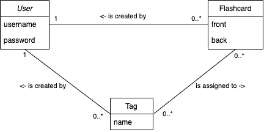

## Overview

This is the backend component of the Flashcards Application, a Java REST API server built with Spring Boot. Flashcards, which are used for memorization, are the central focus of this application, offering a simplified alternative to Anki.

## Domain model



## Run

```bash
docker-compose up
```

## REST API

The REST API is secured using JWT tokens.

Swagger documentation can be accessed at http://localhost:8080/swagger-ui/index.html.
